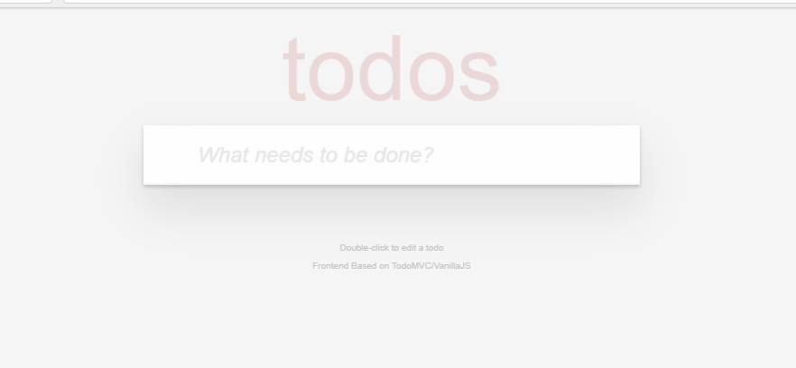

# 一、概述

该模板使用了gin框架并创建了Makefile自动化脚本，启动成功后将展示欢迎页。

**预装环境：**`golang 1.20` `Extentions: Go v0.38`  `git` 等。

## 二、快速开始

使用如下命令，快速运行一个golang程序：

```
# 启动程序
make dev
```

**输出结果：**



### 三.  文件结构

```
workspace/                     
├── cmd   
│   └── todomvc        
│       └── todomvc.go                   # 主程序入口文件
├── conf                                 # 配置文件目录
│   ├── config.local.yml                 # 环境配置文件
│   └── config.local.yml.example         # 示例
├── go.mod                              
├── go.sum                             
├── LICENSE                              # 许可证文件
├── Makefile                             # 自动化脚本
├── pkg                                  # 私有库代码目录
│   └── todomvc                          
│       ├── app.go                 
│       ├── conf                   
│       │   └── conf.go                
│       ├── model                        # 数据模型目录
│       │   ├── model.go            
│       │   └── todo.go          
│       └── router              
│           ├── api.go                   # API路由定义
│           └── handler            
│               └── todo              
│                   └── todo.go       
├── README.md                            # 项目说明文件
├── statics                              # 静态资源目录
│   ├── js                         
│   │   ├── app.js                 
│   │   ├── ...                 
│   └── node_modules                    # Node依赖包目录
│       ├── todomvc-app-css         
│       │   └── index.css             
│       └── todomvc-common          
│           └── base.css              
└── templates                    # HTML模板文件目录
    └── index.tmpl
```

### 2.  Python官方文档与资源

[快速入门 | Gin Web Framework](https://gin-gonic.com/zh-cn/docs/quickstart/)

[gin-gonic](https://github.com/gin-gonic/gin) 

[go-gorm](https://github.com/go-gorm/gorm) 

## 三、  常见问题

[Cloud Studio（云端 IDE） 常见问题-文档中心-腾讯云](https://cloud.tencent.com/document/product/1039/33505)

[Cloud Studio（云端 IDE） | Cloud Studio](https://ide.cloud.tencent.com/docs/)

[Cloud Studio 轻量版 帮助文档](https://docs.qq.com/aio/DRUFZcHVvZlJuY3l2?p=1QOiTiIR9g0KMJneBDyfgM)

## 帮助和支持

##### 欢迎加入Cloud Studio用户反馈群

当您遇到问题需要处理时，您可以直接通过到扫码进入Cloud Studio用户群进行提问.

- 腾讯云工程师实时群内答疑

- 扫码入群可先享受产品上新功能

- 更多精彩活动群内优享


